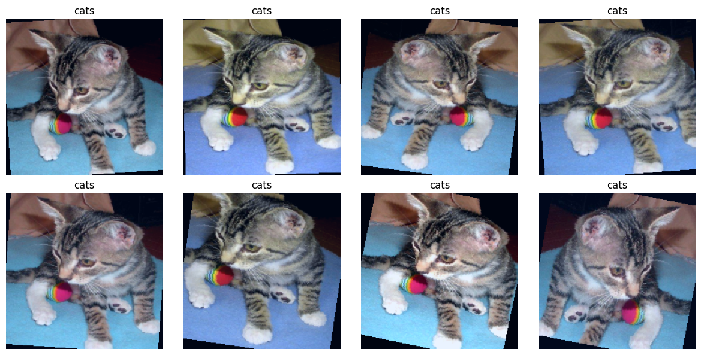

# AnimalClassification - Benchmarking Machine Learning Approaches for Animal Image Classification


A structured experimental pipeline for **animal image classification** comparing:

- classical computer vision approaches
- deep feature extraction
- custom CNN models trained from scratch

The goal of this project is to **systematically benchmark different modeling strategies** under a shared dataset split and transformation pipeline.

The repository is designed to be **reproducible, modular, and experiment-tracked**, allowing fair comparisons between approaches.

---

# Overview

This project investigates how different machine learning paradigms perform on the same classification task:

1. **Handcrafted feature pipelines**
2. **Deep feature extraction using pretrained models**
3. **CNN architectures trained from scratch**

All experiments share:

- a **fixed dataset split**
- a **common transformation pipeline**
- centralized **experiment tracking**
- standardized **metrics and reporting**

The task is a **3-class image classification problem**:
- cats
- dogs
- wildlifey

<!-- 
| Class |
|------|
| cats |
| dogs |
| wildlife | -->

---

# Dataset

The dataset is constructed by merging several public datasets:

| Dataset | Description |
|------|------|
| [Microsoft Cats vs Dogs](https://www.kaggle.com/code/fareselmenshawii/cats-vs-dogs-classification) | Internet images of cats and dogs |
| [AFHQv2](https://www.kaggle.com/datasets/dimensi0n/afhq-512) | High quality images of cats, dogs, and wild animals |
| [Animal Face Dataset (AFD)](https://data.mendeley.com/datasets/z3x59pv4bz/3) | Various wildlife species |
| [HuggingFace Animal Faces](https://huggingface.co/datasets/Pratheesh99/animal-faces-raw) | Cat and dog facial dataset |

After cleaning and deduplication the final dataset contains approximately:

```
Total images ≈ 62,659
cats ≈ 23.7k
dogs ≈ 23.8k
wildlife ≈ 16k
```

The dataset is organized using a deterministic split called:

```
split_v1
```

Dataset sizes:

| Split | Samples |
|------|-------|
| Train | 50,127 |
| Validation | 6,266 |
| Test | 6,266 |

Class distribution:

| Split | Cats | Dogs | Wildlife |
|------|------|------|------|
| Train | 18,954 | 18,315 | 12,858 |
| Validation | 2,369 | 2,290 | 1,607 |
| Test | 2,370 | 2,289 | 1,607 |

The split manifests are stored as:

```
data/splits/split_v1/
```

Files:

```
train.csv
val.csv
test.csv
classes.json
```

Each CSV contains:

```
filepath,label
```

---

# Image Transformations and Augmentation

All models rely on the shared transformation configuration:

```
configs/transforms_v1.yaml
```

Two transformation pipelines are defined.

---

## Training Transform Pipeline

Identifier:

```
transforms_v1_train_runtime_aug
```

Training transformations defined in `configs/transforms_v1.yaml`:

- `RandomResizedCrop(size=224, scale=(0.7, 1.0), ratio=(0.75, 1.3333))`
- `RandomHorizontalFlip(p=0.5)`
- `RandomRotation(degrees=15)`
- `ColorJitter(brightness=0.2, contrast=0.2, saturation=0.2, hue=0.05)`
- `ToTensor()`
- `Normalize(mean=[0.485, 0.456, 0.406], std=[0.229, 0.224, 0.225])`

---

## Evaluation Transform Pipeline

Identifier:

```
transforms_v1_eval_resize256_centercrop224_imagenetnorm
```

Evaluation transformations defined in `configs/transforms_v1.yaml`:

- `Resize(256)`
- `CenterCrop(224)`
- `ToTensor()`
- `Normalize(mean=[0.485, 0.456, 0.406], std=[0.229, 0.224, 0.225])`

---

## Example Augmented Samples




This figure was generated during validation of the transformation pipeline and shows multiple stochastic augmentations of the same source image. It demonstrates how the training pipeline introduces controlled variation through cropping, flipping, rotation, and color jitter without modifying files on disk.

A key design decision is that augmented images are **not stored on disk**. All augmentations are applied dynamically at dataset-loading time.

---

# Experiment Tracking

All experiments are tracked using **MLflow**.

Tracking directory:

```
mlruns/
```

Each training run logs:

- parameters
- metrics
- artifacts
- configuration

Example run contents:

```
params
metrics
artifacts
config.json
```

---

# Models Implemented

This project currently includes the following benchmarked model families and concrete model variants.

## Classical ML with Handcrafted Features
- [HOG + Approximate RBF SVM (`10_01_hog_svm`)](#hog--approximate-rbf-svm)
- [LBP + Approximate RBF SVM (`10_02_lbp_svm`)](#lbp--approximate-rbf-svm)
- [HSV Histogram + Logistic Regression (`10_03_colorhist_lr`)](#hsv-histogram--logistic-regression)

## Deep Features with Fixed Pretrained Encoder
- [ResNet50 Embedding Extraction (`20_01_extract_embeddings_resnet50`)](#embedding-extraction)
- [ResNet50 Embeddings + Logistic Regression (`20_02_lr_on_embeddings`)](#logistic-regression-on-resnet50-embeddings)
- [ResNet50 Embeddings + Approximate RBF SVM (`20_03_svm_on_embeddings`)](#approximate-rbf-svm-on-resnet50-embeddings)

## CNNs Trained From Scratch
- [CustomCNN v1 (`30_01_customcnn_v1`)](#customcnn-v1-architecture)
- [CustomCNN v2 (`30_02_customcnn_v2`)](#customcnn-v2-architecture)

---

# 1 - Classical Computer Vision Pipelines

These models use **handcrafted feature extractors** combined with classical machine learning classifiers.

Advantages:

- extremely fast inference
- interpretable features
- minimal compute requirements

---

## HOG + Approximate RBF SVM

Pipeline:

```
Image
↓
HOG feature extraction
↓
StandardScaler
↓
Nyström RBF feature mapping
↓
LinearSVC
```

Purpose:

Capture structural edge patterns using **Histogram of Oriented Gradients**.

Feature extraction details:

- images resized to `224×224`
- converted to grayscale
- HOG parameters:
  - `orientations = 9`
  - `pixels_per_cell = (8, 8)`
  - `cells_per_block = (2, 2)`
  - `block_norm = L2-Hys`
  - `transform_sqrt = True`

Cached feature dimensionality:

- **26,244 features per image**

Classifier pipeline:

```
StandardScaler(with_mean=False)
→ Nyström(kernel="rbf", n_components=5000, gamma=1/26244)
→ LinearSVC(C=1.0, max_iter=5000)
```

---

## LBP + Approximate RBF SVM

Pipeline:

```
Image
↓
Local Binary Patterns
↓
StandardScaler
↓
Nyström RBF feature mapping
↓
LinearSVC
```

Purpose:

Capture **local texture patterns**.

Feature extraction details:

- images resized to `224×224`
- converted to grayscale
- Local Binary Pattern parameters:
  - `P = 8`
  - `R = 1`
  - `method = "uniform"`

LBP codes are converted into an L1-normalized histogram with:

- **10 features per image**

Classifier pipeline:

```
StandardScaler(with_mean=False)
→ Nyström(kernel="rbf", n_components=2000, gamma=1/10)
→ LinearSVC(C=1.0, max_iter=5000)
```

---

## HSV Histogram + Logistic Regression

Pipeline:

```
Image
↓
HSV color histogram
↓
StandardScaler
↓
Logistic Regression
```

Purpose:

Capture **global color distributions**.

Feature extraction details:

- images resized to `224×224`
- converted from RGB to HSV
- 32-bin histograms computed for each channel:
  - H: 32 bins
  - S: 32 bins
  - V: 32 bins

The concatenated histogram is L1-normalized, producing:

- **96 features per image**

Classifier pipeline:

```
StandardScaler(with_mean=False)
→ LogisticRegression(solver="saga", C=2.0, max_iter=500)
```

---

# 2 - Deep Feature Pipelines

These models use **pretrained CNN encoders** as feature extractors.

The CNN weights remain **frozen**.

Classifier is trained on extracted embeddings.

---

## Embedding Extraction

Embeddings are extracted using a pretrained `torchvision` ResNet50 with ImageNet weights and the classification head removed:

```python
model.fc = torch.nn.Identity()
```

This produces a fixed 2048-dimensional embedding for each image after the deterministic evaluation transform pipeline.

Cached embedding arrays:

```
data/processed/embeddings/split_v1/encoder_resnet50/
├── train.npy
├── val.npy
├── test.npy
├── labels_train.npy
├── labels_val.npy
├── labels_test.npy
└── meta.json
```

Embedding tensor shapes:

```
train: (50127, 2048)
val: (6266, 2048)
test: (6266, 2048)
```

---

## Logistic Regression on ResNet50 Embeddings

Pipeline:

```
ResNet50 embeddings
↓
StandardScaler
↓
LogisticRegression
```

---

## Approximate RBF SVM on ResNet50 Embeddings

Exact RBF SVM is computationally expensive at this scale.

Approximation used:

```
StandardScaler
↓
Nyström RBF kernel approximation
↓
LinearSVC
```

This retains nonlinear decision boundaries while remaining tractable.

---

# 3 - CNN Trained From Scratch

The project also explores models trained entirely from scratch.

---

## CustomCNN v1 Architecture

```
Input (224x224 RGB)

Conv2D 3→32
ReLU
MaxPool

Conv2D 32→64
ReLU
MaxPool

Conv2D 64→128
ReLU
MaxPool

AdaptiveAvgPool

Flatten

Linear 128→256
ReLU
Dropout 0.5

Linear 256→3
```

Model size:

```
127,043 parameters
≈0.485 MB
```

Training configuration:

| Parameter | Value |
|------|------|
| Optimizer | Adam |
| Learning Rate | 1e-3 |
| Weight Decay | 1e-4 |
| Epochs | 30 |
| Dropout | 0.5 |
| Scheduler | ReduceLROnPlateau |

Best validation result:

- **Best epoch:** 28
- **Best validation macro F1:** 0.9487

Test result:

- **Test loss:** 0.1442
- **Test accuracy:** 0.9454
- **Test macro F1:** 0.9472

Inference benchmark (measured on GPU in the training environment):

- **Latency per batch:** 12.4200 ms
- **Latency per image:** 0.1941 ms
- **Throughput:** 5152.97 images/sec
- **Timed batches:** 20

Artifacts saved to:

```
models/cnn_scratch/customcnn_v1/run_20260313_095856/
├── checkpoint.pt
├── config.json
├── metrics.json
├── loss_curve.png
├── accuracy_curve.png
└── exported.onnx
```

ONNX export was attempted but failed in this run due to a missing dependency:

```
ModuleNotFoundError: No module named 'onnxscript'
```

---

## CustomCNN v2 Architecture

`CustomCNN v2` is a deeper scratch CNN that extends `CustomCNN v1` with stacked convolutional blocks and batch normalization.

Architecture:

```text
Input (224x224 RGB)

Block 1
Conv2D 3→32
BatchNorm2d
ReLU
Conv2D 32→32
BatchNorm2d
ReLU
MaxPool

Block 2
Conv2D 32→64
BatchNorm2d
ReLU
Conv2D 64→64
BatchNorm2d
ReLU
MaxPool

Block 3
Conv2D 64→128
BatchNorm2d
ReLU
Conv2D 128→128
BatchNorm2d
ReLU
MaxPool

Classifier head
Adaptive pooling / flatten
Fully connected classifier
Dropout
Output layer (3 classes)
```

This architecture increases representational capacity compared with CustomCNN v1 while preserving the same overall training contract and shared dataset pipeline.

Model size:

```
355,491 parameters
~1.36 MB
```

Training configuration:

| Parameter | Value |
|------|------|
| Optimizer | Adam |
| Learning Rate | 1e-3 |
| Weight Decay | 1e-4 |
| Epochs | 30 |
| Dropout | 0.5 |
| Scheduler | ReduceLROnPlateau |
| Gradient Clipping | 1.0 |
| Seed | 42 |

Best validation result:

```
Best epoch: 27
Best validation macro F1: 0.9746
```

Test result:

```
Test loss: 0.0864
Test accuracy: 0.9714
Test macro F1: 0.9722
```

Artifacts saved to:

```
models/cnn_scratch/customcnn_v2/run_20260313_114741/
├── checkpoint.pt
├── config.json
├── metrics.json
├── loss_curve.png
├── accuracy_curve.png
└── exported.onnx
```

ONNX export was attempted but failed in this run due to a missing dependency:

```
ModuleNotFoundError: No module named 'onnxscript'
```

---

# Experimental Results

| Model | Category | Test Accuracy | Macro F1 | Latency (ms/image) | Throughput (img/s) | Params | Size MB |
|------|------|------:|------:|------:|------:|------:|------:|
| HOG + Approx. RBF SVM | Handcrafted Features | 0.8024 | - | - | - | - | - |
| LBP + Approx. RBF SVM | Handcrafted Features | 0.6432 | 0.6542 | - | - | - | - |
| HSV Histogram + Logistic Regression | Handcrafted Features | 0.5115 | 0.5123 | - | - | - | - |
| ResNet50 Embeddings + Logistic Regression | Deep Features | 0.9949 | 0.9950 | - | - | - | - |
| ResNet50 Embeddings + Approx. RBF SVM | Deep Features | 0.9877 | 0.9882 | - | - | - | - |
| CustomCNN v1 | CNN from Scratch | 0.9454 | 0.9472 | 0.1941 | 5152.97 | 127,043 | 0.485 |
| CustomCNN v2 | CNN from Scratch | 0.9714 | 0.9722 | - | - | 355,491 | 1.360 |

*Note: A centralized benchmark notebook for standardized inference-cost evaluation across all models is planned. Metrics not yet benchmarked in the same environment are intentionally shown as `-`.*

The strongest results so far come from **fixed deep features extracted by ImageNet-pretrained ResNet50**, especially when paired with a simple logistic regression classifier. Among models trained from scratch, `CustomCNN v2` substantially improves over `CustomCNN v1`, while remaining compact enough for efficient deployment. Classical handcrafted baselines remain useful as interpretable references but are clearly outperformed by learned visual representations on this dataset.

---

## Scratch CNN Comparison

`CustomCNN v2` improves over `CustomCNN v1` by using a deeper stacked-convolution design with batch normalization in each block. This increases parameter count from **127,043** to **355,491**, but also raises test macro F1 from **0.9472** to **0.9722**. In practice, `CustomCNN v2` offers a much stronger scratch-trained baseline while remaining relatively lightweight compared with large pretrained backbones.

---

# Example Predictions

Prediction examples stored in:

```
docs/images/predictions/
```

Example output:

```
cat_01_pred.png
dog_04_pred.png
wildlife_03_pred.png
```

Each example shows:

- input image
- predicted class
- model confidence

---

## Current Stored Figures and Artifacts

The repository already contains generated artifacts from preprocessing and training runs, including:

- `reports/figures/class_distribution.png`
- `reports/figures/sample_augmented_images.png`
- `models/cnn_scratch/customcnn_v1/run_20260313_095856/loss_curve.png`
- `models/cnn_scratch/customcnn_v1/run_20260313_095856/accuracy_curve.png`
- `models/cnn_scratch/customcnn_v2/run_20260313_114741/loss_curve.png`
- `models/cnn_scratch/customcnn_v2/run_20260313_114741/accuracy_curve.png`

These artifacts support both qualitative inspection and reproducibility of the reported experiments.

---

# Project Structure

```
AnimalClassification/
│
├── configs/
│   └── transforms_v1.yaml
│
├── data/
│   ├── prepared/
│   ├── processed/
│   │   ├── features/
│   │   └── embeddings/
│   └── splits/
│       └── split_v1/
│
├── docs/
│   └── images/
│
├── mlruns/
│
├── models/
│   ├── ml_basic_features/
│   ├── ml_deep_features/
│   └── cnn_scratch/
│
├── notebooks/
│   ├── 00_project_setup.ipynb
│   ├── 01_data_prep_and_splits.ipynb
│   ├── 02_transforms_and_augmentation.ipynb
│   ├── 10_ml_basic_features/
│   │   ├── 10_01_hog_svm.ipynb
│   │   ├── 10_02_lbp_svm.ipynb
│   │   └── 10_03_colorhist_lr.ipynb
│   ├── 20_ml_deep_features_fixed_encoder/
│   │   ├── 20_01_extract_embeddings_resnet50.ipynb
│   │   ├── 20_02_lr_on_embeddings.ipynb
│   │   └── 20_03_svm_on_embeddings.ipynb
│   └── 30_cnn_scratch_custom/
│       ├── 30_00_overview.ipynb
│       ├── 30_01_customcnn_v1.ipynb
│       └── 30_02_customcnn_v2.ipynb
│
├── scripts/
│   ├── dataset_check.py
│   ├── dedup_delete.py
│   ├── huggin_face_dataset_downloader.py
│   └── prepare_data.py
│
├── src/
│   ├── data/
│   │   ├── __init__.py
│   │   ├── dataset_loader.py
│   │   ├── split_generator.py
│   │   └── transforms.py
│   └── models/
│       └── cnn_scratch/
│           ├── __init__.py
│           ├── models.py
│           └── utils.py
│
├── reports/
│   ├── metrics/
│   └── figures/
│
├── requirements.txt
└── README.md
```

---

## Notebook Roles

### Root notebooks

- **`00_project_setup.ipynb`** - initial dataset and directory validation, class-folder checks, image counting, and random visualization.
- **`01_data_prep_and_splits.ipynb`** - deterministic stratified split generation for `split_v1`, class distribution analysis, JSON summary export, and MLflow dataset logging.
- **`02_transforms_and_augmentation.ipynb`** - transform configuration validation, dataset loader testing, augmented-sample visualization, and DataLoader sanity checks.

### Classical ML notebooks

- **`10_01_hog_svm.ipynb`** - trains the HOG + approximate RBF SVM baseline using cached HOG features.
- **`10_02_lbp_svm.ipynb`** - trains the LBP + approximate RBF SVM baseline using cached LBP histogram features.
- **`10_03_colorhist_lr.ipynb`** - trains the HSV color histogram + logistic regression baseline.

### Deep feature notebooks

- **`20_01_extract_embeddings_resnet50.ipynb`** - extracts and caches 2048-dimensional ResNet50 embeddings for all fixed splits.
- **`20_02_lr_on_embeddings.ipynb`** - trains logistic regression on cached ResNet50 embeddings.
- **`20_03_svm_on_embeddings.ipynb`** - trains an approximate RBF SVM on cached ResNet50 embeddings.

### CNN-from-scratch notebooks

- **`30_00_overview.ipynb`** - validates Phase 3 readiness, shared transforms, loaders, paths, devices, and run contracts.
- **`30_01_customcnn_v1.ipynb`** - trains the first scratch CNN baseline and benchmarks its inference speed.
- **`30_02_customcnn_v2.ipynb`** - trains the deeper scratch CNN with batch normalization and exports comparable run artifacts.

---

# Folder Descriptions

### `configs/`

Configuration files shared across experiments.

- **`transforms_v1.yaml`** - central definition of training and evaluation preprocessing pipelines.

### `data/`

Data assets and cached intermediate representations.

- **`prepared/`** - final cleaned dataset organized by class.
- **`splits/split_v1/`** - deterministic train/validation/test CSV manifests and `classes.json`.
- **`processed/features/`** - cached handcrafted features such as HOG and color histograms.
- **`processed/embeddings/`** - cached deep embeddings extracted from pretrained encoders.

### `scripts/`

Standalone data-preparation and maintenance utilities.

- **`dataset_check.py`** - quick validation and inspection of dataset files.
- **`dedup_delete.py`** - duplicate-removal cleanup utility.
- **`huggin_face_dataset_downloader.py`** - dataset acquisition helper for Hugging Face sources.
- **`prepare_data.py`** - dataset merge/cleanup/preparation helper.

### `src/data/`

Reusable data-pipeline code.

- **`dataset_loader.py`** - reusable image dataset loader with CSV-manifest support and path normalization.
- **`split_generator.py`** - deterministic stratified split generation and split validation utilities.
- **`transforms.py`** - YAML-driven train/eval transform construction.

### `src/models/cnn_scratch/`

Scratch-CNN implementation code.

- **`models.py`** - model builders and CNN architecture definitions such as `CustomCNNv1` and `CustomCNNv2`.
- **`utils.py`** - training loop, evaluation, checkpointing, ONNX export, curve saving, and benchmarking helpers.

### `models/`

Per-run trained model artifacts.

- **`ml_basic_features/`** - serialized classical ML models based on handcrafted features.
- **`ml_deep_features/`** - classifiers trained on cached deep embeddings.
- **`cnn_scratch/`** - checkpointed scratch CNN experiments with plots and metrics.

### `reports/`

Saved metrics and figures.

- **`metrics/`** - exported JSON summaries for experiments and phase validation.
- **`figures/`** - plots and visualization artifacts such as class distributions and augmentation examples.

### `mlruns/`

MLflow experiment tracking directory.

### `notebooks/`

Phase-organized experiment notebooks covering setup, preprocessing, classical ML, deep features, and scratch CNN training.

---

# Hardware

Observed training environment in the provided experiment runs:

- **CUDA GPU available**
- Scratch CNN training notebooks ran on **GPU**
- Data loading used:
  - `batch_size = 64`
  - `num_workers = 8`
  - `pin_memory = True`

A future centralized benchmark notebook will report standardized hardware metadata for all evaluated models, including:

- device used for timing
- GPU name
- GPU memory
- system RAM
- CPU/GPU inference comparisons where applicable

---

# License

This repository is released under the **MIT License**.

```text
MIT License

Copyright (c) 2026

Permission is hereby granted, free of charge, to any person obtaining a copy
of this software and associated documentation files to deal in the Software
without restriction, including without limitation the rights to use, copy,
modify, merge, publish, distribute, sublicense, and/or sell copies of the
Software.
```

---

# Software Environment

Experiments were developed in a Python 3.12 environment. Core package versions include:

| Package | Version |
|------|------|
| torch | 2.10.0 |
| torchvision | 0.25.0 |
| scikit-learn | 1.8.0 |
| scikit-image | 0.26.0 |
| numpy | 2.4.2 |
| pandas | 2.3.3 |
| matplotlib | 3.10.8 |
| mlflow | 3.10.0 |
| Pillow | 12.1.1 |
| PyYAML | 6.0.3 |
| tqdm | 4.67.3 |

A full frozen environment snapshot can be provided separately in `requirements.txt` or a dedicated environment lock file.

---

# Acknowledgements

This project was developed using the computational resources provided by **CeDAR (Center for Data Analytics and Research)** at **ADA University**.

---

# Future Work

Planned next steps include:

- centralized benchmark notebook covering all trained models
- standardized inference timing under one shared environment
- additional metrics such as F2 score, specificity, and per-class sensitivity
- hardware-aware reporting (GPU model, VRAM, RAM, CPU/GPU timing)
- completion of remaining model families beyond the current baselines
- improved ONNX export support by adding missing export dependencies

---

# Status

This project is currently **in active development**.

Additional models and benchmarking results will be added as experiments complete.