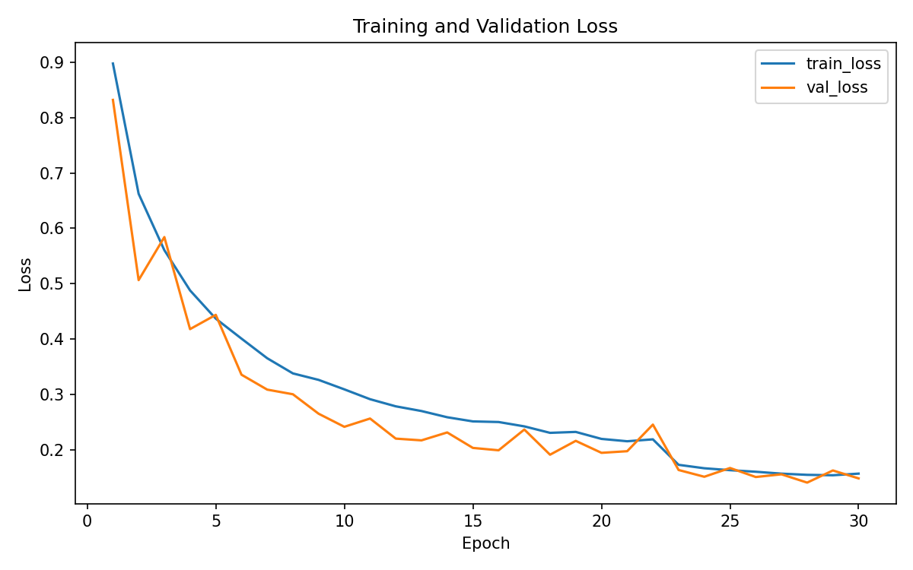
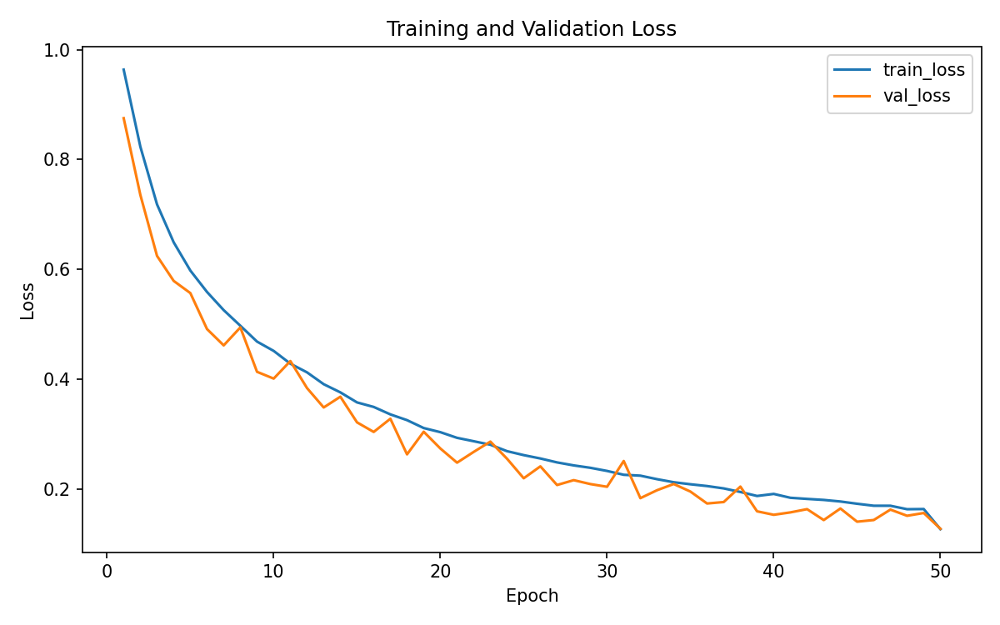
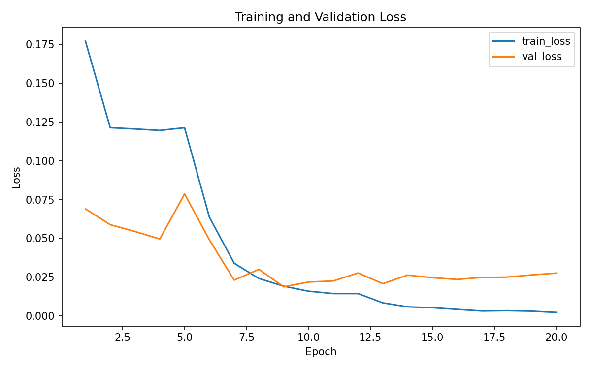
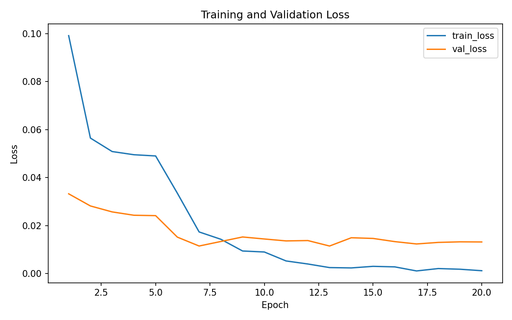
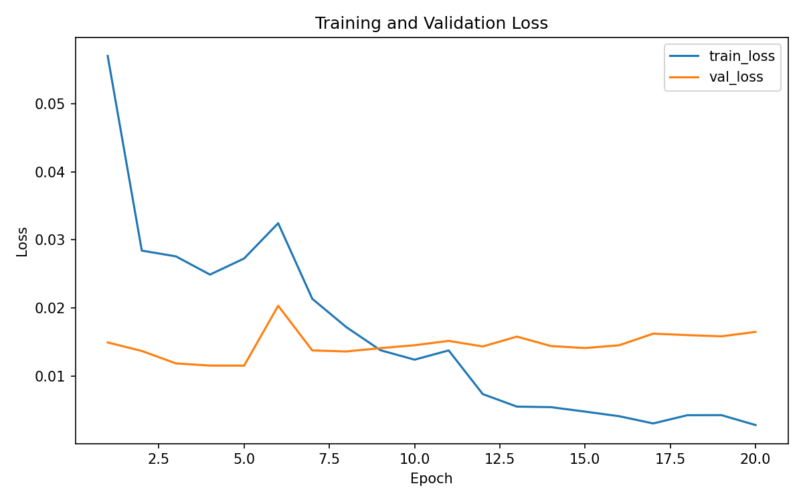
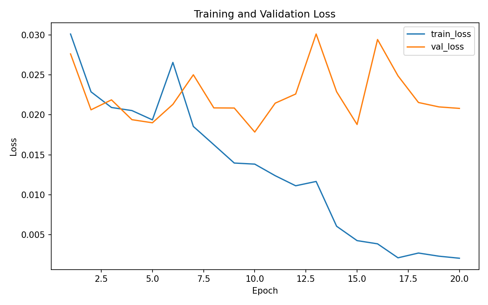

# AnimalClassification - Benchmarking Machine Learning Approaches for Animal Image Classification


A structured experimental pipeline for **animal image classification** comparing:

- classical computer vision approaches
- deep feature extraction
- custom CNN models trained from scratch
- pretrained CNN transfer learning
- pretrained Vision Transformer families
- custom Vision Transformers trained from scratch

The goal of this project is to **systematically benchmark different modeling strategies** under a shared dataset split and transformation pipeline.

The repository is designed to be **reproducible, modular, and experiment-tracked**, allowing fair comparisons between approaches. The project benchmarks handcrafted-feature pipelines, pretrained deep-feature extraction, convolutional neural networks trained from scratch, and pretrained CNN transfer-learning models on a common three-class dataset consisting of **cats, dogs, and wildlife** images.

---

# Course Submission Information

This repository is submitted as part of **CSCI 4701: Deep Learning** and represents a group project submission.

## Team Members and Contribution

| Student | ID | Email | Contribution |
|------|------:|------|------:|
| Rufiz Bayramov | 16980 | rbayramov16980@ada.edu.az | 1/3 |
| Javad Taghiyev | 18172 | jtaghiyev18172@ada.edu.az | 1/3 |
| Asliddin Isroilov | 16788 | aisroilov16788@ada.edu.az | 1/3 |

## Scope Clarification

The most direct coursework contribution is concentrated in the scratch-CNN notebooks:

- `notebooks/30_cnn_scratch_custom/30_01_customcnn_v1.ipynb`
- `notebooks/30_cnn_scratch_custom/30_02_customcnn_v2.ipynb`

These notebooks apply the core deep learning material most explicitly: CNN architecture design, data augmentation, optimization, regularization, batch normalization, training loops, validation, checkpointing, and model evaluation in PyTorch.

Several later notebooks are also directly related to the course syllabus:

- `notebooks/40_cnn_pretrained/40_01_resnet18_pretrained.ipynb`
- `notebooks/40_cnn_pretrained/40_02_mobilenet_v3_large_pretrained.ipynb`
- `notebooks/40_cnn_pretrained/40_03_efficientnet_b0_pretrained.ipynb`
- `notebooks/40_cnn_pretrained/40_04_resnet50_pretrained.ipynb`
- `notebooks/40_cnn_pretrained/40_05_efficientnet_b2_pretrained.ipynb`
- `notebooks/50_vit/50_01_vit_b_16.ipynb`
- `notebooks/50_vit/50_02_swin_t.ipynb`
- `notebooks/50_vit/50_03_swin_v2_s.ipynb`
- `notebooks/50_vit/50_04_maxvit_t.ipynb`

The `40_` notebooks connect directly to pretrained CNN architectures, transfer learning, and fine-tuning, including ResNet, MobileNet, and EfficientNet-style models. The selected `50_` notebooks are included as a course-adjacent extension because visual transformers were briefly covered and they provide a modern attention-based comparison point against CNN families.

Earlier baseline and framework components, including classical ML baselines, fixed deep-feature extraction, exploratory utilities, and some project scaffolding, were initiated near the beginning of the semester with assistance from AI tools/agents. Those components are retained for benchmarking context, while the final repository has been organized, audited, rerun, and documented as a coherent course project.

Some implementation work also preceded the full formal coverage of the corresponding theory in class. As the course progressed, the project was updated with stronger interpretation of optimization, regularization, convolutional inductive bias, transfer learning, and attention-based architectures.

---

# Table of Contents

- [Course Submission Information](#course-submission-information)
- [Overview](#overview)
- [Dataset](#dataset)
- [Experiment Tracking](#experiment-tracking)
- [Models Implemented](#models-implemented)
- [Pretrained CNN Transfer Learning](#4---pretrained-cnn-transfer-learning)
- [Pretrained Vision Transformer Transfer Learning](#5---pretrained-vision-transformer-transfer-learning)
- [Vision Transformers From Scratch](#6---vision-transformers-from-scratch)
- [Experimental Results](#experimental-results)
- [Loss Curve Snapshot](#loss-curve-snapshot)
- [Project Structure](#project-structure)
- [Hardware](#hardware)

---

# Overview

This project investigates how different machine learning paradigms perform on the same classification task:

1. **Handcrafted feature pipelines**
2. **Deep feature extraction using pretrained models**
3. **CNN architectures trained from scratch**
4. **Pretrained CNNs fine-tuned end to end**
5. **Pretrained Vision Transformer families**
6. **Custom Vision Transformers trained from scratch**

The comparison is designed to be fair by keeping dataset splits, preprocessing logic, and reporting structure as consistent as possible across experiments.

All experiments share:

- a **fixed dataset split**
- a **common transformation pipeline**
- centralized **experiment tracking**
- standardized **metrics and reporting**

The task is a **3-class image classification problem**:
- cats
- dogs
- wildlife

<!--
| Class |
|------|
| cats |
| dogs |
| wildlife | -->

---

# Dataset

The dataset is constructed by merging several public datasets in order to create a larger and more diverse three-class benchmark for animal image classification:

| Dataset | Description |
|------|------|
| [Microsoft Cats vs Dogs](https://www.kaggle.com/code/fareselmenshawii/cats-vs-dogs-classification) | Internet images of cats and dogs |
| [AFHQv2](https://www.kaggle.com/datasets/dimensi0n/afhq-512) | High quality images of cats, dogs, and wild animals |
| [Animal Face Dataset (AFD)](https://data.mendeley.com/datasets/z3x59pv4bz/3) | Various wildlife species |
| [HuggingFace Animal Faces](https://huggingface.co/datasets/Pratheesh99/animal-faces-raw) | Cat and dog facial dataset |

After cleaning and deduplication the final dataset contains approximately:

```
Total images ~= 62,659
cats ~= 23.7k
dogs ~= 23.8k
wildlife ~= 16k
```

The dataset is organized using a deterministic split called:

```
split_v1
```

Dataset sizes:

| Split | Samples |
|------|-------|
| Train | 50,127 |
| Validation | 6,266 |
| Test | 6,266 |

Class distribution:

| Split | Cats | Dogs | Wildlife |
|------|------|------|------|
| Train | 18,954 | 18,315 | 12,858 |
| Validation | 2,369 | 2,290 | 1,607 |
| Test | 2,370 | 2,289 | 1,607 |

The split manifests are stored as:

```
data/splits/split_v1/
```

Files:

```
train.csv
val.csv
test.csv
classes.json
```

Each CSV contains:

```
filepath,label
```

---

# Image Transformations and Augmentation

All models rely on the shared transformation configuration:

```
configs/transforms_v1.yaml
```

Two transformation pipelines are defined.

---

## Training Transform Pipeline

Identifier:

```
transforms_v1_train_runtime_aug
```

Training transformations defined in `configs/transforms_v1.yaml`:

- `RandomResizedCrop(size=224, scale=(0.7, 1.0), ratio=(0.75, 1.3333))`
- `RandomHorizontalFlip(p=0.5)`
- `RandomRotation(degrees=15)`
- `ColorJitter(brightness=0.2, contrast=0.2, saturation=0.2, hue=0.05)`
- `ToTensor()`
- `Normalize(mean=[0.485, 0.456, 0.406], std=[0.229, 0.224, 0.225])`

---

## Evaluation Transform Pipeline

Identifier:

```
transforms_v1_eval_resize256_centercrop224_imagenetnorm
```

Evaluation transformations defined in `configs/transforms_v1.yaml`:

- `Resize(256)`
- `CenterCrop(224)`
- `ToTensor()`
- `Normalize(mean=[0.485, 0.456, 0.406], std=[0.229, 0.224, 0.225])`

---

## Example Augmented Samples


This figure was generated during validation of the transformation pipeline and shows multiple stochastic augmentations of the same source image. It demonstrates how the training pipeline introduces controlled variation through cropping, flipping, rotation, and color jitter without modifying files on disk.

A key design decision is that augmented images are **not stored on disk**. All augmentations are applied dynamically at dataset-loading time.

---

# Experiment Tracking

All experiments are tracked using **MLflow**.

Tracking directory:

```
mlruns/
```

Each training run logs:

- parameters
- metrics
- artifacts
- configuration

Example run contents:

```
params
metrics
artifacts
config.json
```

---

# Models Implemented

This project includes the following implemented and benchmarked model families and concrete model variants.

## Classical ML with Handcrafted Features
- [HOG + Approximate RBF SVM (`10_01_hog_svm`)](#hog--approximate-rbf-svm)
- [LBP + Approximate RBF SVM (`10_02_lbp_svm`)](#lbp--approximate-rbf-svm)
- [HSV Histogram + Logistic Regression (`10_03_colorhist_lr`)](#hsv-histogram--logistic-regression)

## Deep Features with Fixed Pretrained Encoder
- [ResNet50 Embedding Extraction (`20_01_extract_embeddings_resnet50`)](#embedding-extraction)
- [ResNet50 Embeddings + Logistic Regression (`20_02_lr_on_embeddings`)](#logistic-regression-on-resnet50-embeddings)
- [ResNet50 Embeddings + Approximate RBF SVM (`20_03_svm_on_embeddings`)](#approximate-rbf-svm-on-resnet50-embeddings)

## CNNs Trained From Scratch
- [CustomCNN v1 (`30_01_customcnn_v1`)](#customcnn-v1-architecture)
- [CustomCNN v2 (`30_02_customcnn_v2`)](#customcnn-v2-architecture)

## Pretrained CNN Transfer Learning
- [ResNet18 Pretrained (`40_01_resnet18_pretrained`)](#resnet18-pretrained)
- [MobileNetV3 Large Pretrained (`40_02_mobilenet_v3_large_pretrained`)](#mobilenetv3-large-pretrained)
- [EfficientNet-B0 Pretrained (`40_03_efficientnet_b0_pretrained`)](#efficientnet-b0-pretrained)
- [ResNet50 Pretrained (`40_04_resnet50_pretrained`)](#resnet50-pretrained)
- [EfficientNet-B2 Pretrained (`40_05_efficientnet_b2_pretrained`)](#efficientnet-b2-pretrained)

## Pretrained Vision Transformers
- [ViT-B/16 Pretrained (`50_01_vit_b_16`)](#vit-b16-pretrained)
- [Swin-T Pretrained (`50_02_swin_t`)](#swin-t-pretrained)
- [Swin V2-S Pretrained (`50_03_swin_v2_s`)](#swin-v2-s-pretrained)
- [MaxViT-T Pretrained (`50_04_maxvit_t`)](#maxvit-t-pretrained)

## Vision Transformers From Scratch
- [CustomViT v1 (`60_01_customvit_v1`)](#customvit-v1)
- [CustomViT v2 (`60_02_customvit_v2`)](#customvit-v2)

---

# 1 - Classical Computer Vision Pipelines

These models use **handcrafted feature extractors** combined with classical machine learning classifiers.

Advantages:

- extremely fast inference
- interpretable features
- minimal compute requirements

---

## HOG + Approximate RBF SVM

Pipeline:

```
Image
v
HOG feature extraction
v
StandardScaler
v
Nystrom RBF feature mapping
v
LinearSVC
```

Purpose:

Capture structural edge patterns using **Histogram of Oriented Gradients**.

Feature extraction details:

- images resized to `224x224`
- converted to grayscale
- HOG parameters:
  - `orientations = 9`
  - `pixels_per_cell = (8, 8)`
  - `cells_per_block = (2, 2)`
  - `block_norm = L2-Hys`
  - `transform_sqrt = True`

Cached feature dimensionality:

- **26,244 features per image**

Classifier pipeline:

```
StandardScaler(with_mean=False)
-> Nystrom(kernel="rbf", n_components=5000, gamma=1/26244)
-> LinearSVC(C=1.0, max_iter=5000)
```

---

## LBP + Approximate RBF SVM

Pipeline:

```
Image
v
Local Binary Patterns
v
StandardScaler
v
Nystrom RBF feature mapping
v
LinearSVC
```

Purpose:

Capture **local texture patterns**.

Feature extraction details:

- images resized to `224x224`
- converted to grayscale
- Local Binary Pattern parameters:
  - `P = 8`
  - `R = 1`
  - `method = "uniform"`

LBP codes are converted into an L1-normalized histogram with:

- **10 features per image**

Classifier pipeline:

```
StandardScaler(with_mean=False)
-> Nystrom(kernel="rbf", n_components=2000, gamma=1/10)
-> LinearSVC(C=1.0, max_iter=5000)
```

---

## HSV Histogram + Logistic Regression

Pipeline:

```
Image
v
HSV color histogram
v
StandardScaler
v
Logistic Regression
```

Purpose:

Capture **global color distributions**.

Feature extraction details:

- images resized to `224x224`
- converted from RGB to HSV
- 32-bin histograms computed for each channel:
  - H: 32 bins
  - S: 32 bins
  - V: 32 bins

The concatenated histogram is L1-normalized, producing:

- **96 features per image**

Classifier pipeline:

```
StandardScaler(with_mean=False)
-> LogisticRegression(solver="saga", C=2.0, max_iter=500)
```

---

# 2 - Deep Feature Pipelines

These models use **pretrained CNN encoders** as feature extractors.

The CNN weights remain **frozen**.

Classifier is trained on extracted embeddings.

---

## Embedding Extraction

Embeddings are extracted using a pretrained `torchvision` ResNet50 with ImageNet weights and the classification head removed:

```python
model.fc = torch.nn.Identity()
```

This produces a fixed 2048-dimensional embedding for each image after the deterministic evaluation transform pipeline.

Cached embedding arrays:

```
data/processed/embeddings/split_v1/encoder_resnet50/
|-- train.npy
|-- val.npy
|-- test.npy
|-- labels_train.npy
|-- labels_val.npy
|-- labels_test.npy
`-- meta.json
```

Embedding tensor shapes:

```
train: (50127, 2048)
val: (6266, 2048)
test: (6266, 2048)
```

---

## Logistic Regression on ResNet50 Embeddings

Pipeline:

```
ResNet50 embeddings
v
StandardScaler
v
LogisticRegression
```

---

## Approximate RBF SVM on ResNet50 Embeddings

Exact RBF SVM is computationally expensive at this scale.

Approximation used:

```
StandardScaler
v
Nystrom RBF kernel approximation
v
LinearSVC
```

This retains nonlinear decision boundaries while remaining tractable.

---

# 3 - CNN Trained From Scratch

The project also explores models trained entirely from scratch.

---

## CustomCNN v1 Architecture

```
Input (224x224 RGB)

Conv2D 3->32
ReLU
MaxPool

Conv2D 32->64
ReLU
MaxPool

Conv2D 64->128
ReLU
MaxPool

AdaptiveAvgPool

Flatten

Linear 128->256
ReLU
Dropout 0.5

Linear 256->3
```

Model size:

```
127,043 parameters
~=0.485 MB
```

Training configuration:

| Parameter | Value |
|------|------|
| Optimizer | Adam |
| Learning Rate | 1e-3 |
| Weight Decay | 1e-4 |
| Epochs | 30 |
| Dropout | 0.5 |
| Scheduler | ReduceLROnPlateau |

Best validation result:

- **Best epoch:** 28
- **Best validation macro F1:** 0.9487

Test result:

- **Test loss:** 0.1442
- **Test accuracy:** 0.9454
- **Test macro F1:** 0.9472

Inference benchmark (measured on GPU in the training environment):

- **Latency per batch:** 12.4200 ms
- **Latency per image:** 0.1941 ms
- **Throughput:** 5152.97 images/sec
- **Timed batches:** 20

Artifacts saved to:

```
models/cnn_scratch/customcnn_v1/run_20260313_095856/
|-- checkpoint.pt
|-- config.json
|-- metrics.json
|-- loss_curve.png
|-- accuracy_curve.png
`-- exported.onnx
```

ONNX export was attempted but failed in this run due to a missing dependency:

```
ModuleNotFoundError: No module named 'onnxscript'
```

---

## CustomCNN v2 Architecture

`CustomCNN v2` is a deeper scratch CNN that extends `CustomCNN v1` with stacked convolutional blocks and batch normalization.

Architecture:

```text
Input (224x224 RGB)

Block 1
Conv2D 3->32
BatchNorm2d
ReLU
Conv2D 32->32
BatchNorm2d
ReLU
MaxPool

Block 2
Conv2D 32->64
BatchNorm2d
ReLU
Conv2D 64->64
BatchNorm2d
ReLU
MaxPool

Block 3
Conv2D 64->128
BatchNorm2d
ReLU
Conv2D 128->128
BatchNorm2d
ReLU
MaxPool

Classifier head
Adaptive pooling / flatten
Fully connected classifier
Dropout
Output layer (3 classes)
```

This architecture increases representational capacity compared with CustomCNN v1 while preserving the same overall training contract and shared dataset pipeline.

Model size:

```
355,491 parameters
~1.36 MB
```

Training configuration:

| Parameter | Value |
|------|------|
| Optimizer | Adam |
| Learning Rate | 1e-3 |
| Weight Decay | 1e-4 |
| Epochs | 30 |
| Dropout | 0.5 |
| Scheduler | ReduceLROnPlateau |
| Gradient Clipping | 1.0 |
| Seed | 42 |

Best validation result:

```
Best epoch: 27
Best validation macro F1: 0.9746
```

Test result:

```
Test loss: 0.0864
Test accuracy: 0.9714
Test macro F1: 0.9722
```

Artifacts saved to:

```
models/cnn_scratch/customcnn_v2/run_20260313_114741/
|-- checkpoint.pt
|-- config.json
|-- metrics.json
|-- loss_curve.png
|-- accuracy_curve.png
`-- exported.onnx
```

ONNX export was attempted but failed in this run due to a missing dependency:

```
ModuleNotFoundError: No module named 'onnxscript'
```

---

# 4 - Pretrained CNN Transfer Learning

Phase 4 extends the benchmark to **end-to-end pretrained CNN classifiers** initialized from official ImageNet weights in `torchvision`.

Unlike the fixed-embedding pipelines in Phase 2, these models:

- replace the original ImageNet classification head with a 3-class head
- train the new head first with the backbone frozen
- then partially fine-tune the pretrained backbone
- log the same benchmark outputs used by the scratch CNN family:
  - checkpoint
  - config
  - metrics
  - training curves
  - latency and throughput estimates

Shared transfer-learning training recipe:

| Parameter | Value |
|------|------|
| Head-only epochs | 5 |
| Partial fine-tuning epochs | 15 |
| Optimizer | AdamW |
| Head learning rate | 1e-3 |
| Backbone learning rate | 1e-4 |
| Weight decay | 1e-4 |
| Scheduler | ReduceLROnPlateau |
| Gradient clipping | 1.0 |
| Seed | 42 |

All models use:

- `split_v1`
- `transforms_v1`
- ImageNet normalization
- the same project-level MLflow and artifact conventions as the `30_` notebooks

---

## ResNet18 Pretrained

Architecture summary:

- ImageNet-pretrained `torchvision` ResNet18
- original `fc` replaced with:
  - `Dropout(0.3) -> Linear(... -> 3)`
- Stage 1:
  - train classifier head only
- Stage 2:
  - unfreeze `layer4` and continue fine-tuning

Weights:

- `IMAGENET1K_V1`

Model size:

```
11,178,051 parameters
~42.68 MB
```

Best validation result:

- **Best epoch:** 13
- **Best validation macro F1:** 0.9951

Test result:

- **Test loss:** 0.0206
- **Test accuracy:** 0.9947
- **Test macro F1:** 0.9949

Inference benchmark:

- **Latency per image:** 0.2786 ms
- **Throughput:** 3588.84 images/sec

Artifacts saved to:

```
models/cnn_pretrained/resnet18_pretrained/run_20260403_103808/
|-- checkpoint.pt
|-- config.json
|-- metrics.json
|-- loss_curve.png
`-- accuracy_curve.png
```

---

## MobileNetV3 Large Pretrained

Architecture summary:

- ImageNet-pretrained `torchvision` MobileNetV3 Large
- final classifier replaced with:
  - `Dropout(0.3) -> Linear(... -> 3)`
- Stage 1:
  - train classifier only
- Stage 2:
  - unfreeze the final feature block group and fine-tune

Weights:

- `IMAGENET1K_V2`

Model size:

```
2,974,835 parameters
~11.44 MB
```

Best validation result:

- **Best epoch:** 8
- **Best validation macro F1:** 0.9933

Test result:

- **Test loss:** 0.0264
- **Test accuracy:** 0.9914
- **Test macro F1:** 0.9918

Inference benchmark:

- **Latency per image:** 0.4396 ms
- **Throughput:** 2275.05 images/sec

Artifacts saved to:

```
models/cnn_pretrained/mobilenet_v3_large_pretrained/run_20260403_111528/
|-- checkpoint.pt
|-- config.json
|-- metrics.json
|-- loss_curve.png
`-- accuracy_curve.png
```

---

## EfficientNet-B0 Pretrained

Architecture summary:

- ImageNet-pretrained `torchvision` EfficientNet-B0
- final classifier replaced with:
  - `Dropout(0.3) -> Linear(... -> 3)`
- Stage 1:
  - train classifier only
- Stage 2:
  - unfreeze the final feature stage and fine-tune

Weights:

- `IMAGENET1K_V1`

Model size:

```
4,011,391 parameters
~15.46 MB
```

Best validation result:

- **Best epoch:** 13
- **Best validation macro F1:** 0.9945

Test result:

- **Test loss:** 0.0261
- **Test accuracy:** 0.9928
- **Test macro F1:** 0.9932

Inference benchmark:

- **Latency per image:** 0.4424 ms
- **Throughput:** 2260.58 images/sec

Artifacts saved to:

```
models/cnn_pretrained/efficientnet_b0_pretrained/run_20260403_111752/
|-- checkpoint.pt
|-- config.json
|-- metrics.json
|-- loss_curve.png
`-- accuracy_curve.png
```

---

## ResNet50 Pretrained

Architecture summary:

- ImageNet-pretrained `torchvision` ResNet50
- original `fc` replaced with:
  - `Dropout(0.3) -> Linear(... -> 3)`
- Stage 1:
  - train classifier head only
- Stage 2:
  - unfreeze `layer4` and fine-tune

Weights:

- `IMAGENET1K_V2`

Model size:

```
23,514,179 parameters
~89.90 MB
```

Best validation result:

- **Best epoch:** 18
- **Best validation macro F1:** 0.9973

Test result:

- **Test loss:** 0.0232
- **Test accuracy:** 0.9959
- **Test macro F1:** 0.9961

Inference benchmark:

- **Latency per image:** 0.5290 ms
- **Throughput:** 1890.34 images/sec

Artifacts saved to:

```
models/cnn_pretrained/resnet50_pretrained/run_20260403_114106/
|-- checkpoint.pt
|-- config.json
|-- metrics.json
|-- loss_curve.png
`-- accuracy_curve.png
```

---

## EfficientNet-B2 Pretrained

Architecture summary:

- ImageNet-pretrained `torchvision` EfficientNet-B2
- final classifier replaced with:
  - `Dropout(0.3) -> Linear(... -> 3)`
- Stage 1:
  - train classifier only
- Stage 2:
  - unfreeze the final feature stage and fine-tune

Weights:

- `IMAGENET1K_V1`

Model size:

```
7,705,221 parameters
~29.65 MB
```

Best validation result:

- **Best epoch:** 12
- **Best validation macro F1:** 0.9949

Test result:

- **Test loss:** 0.0267
- **Test accuracy:** 0.9938
- **Test macro F1:** 0.9941

Inference benchmark:

- **Latency per image:** 0.5408 ms
- **Throughput:** 1849.21 images/sec

Artifacts saved to:

```
models/cnn_pretrained/efficientnet_b2_pretrained/run_20260403_121522/
|-- checkpoint.pt
|-- config.json
|-- metrics.json
|-- loss_curve.png
`-- accuracy_curve.png
```

---

As with the scratch-CNN runs, ONNX export was attempted during Phase 4 but failed because the required export dependency was not available:

```
ModuleNotFoundError: No module named 'onnxscript'
```

---

# 5 - Pretrained Vision Transformer Transfer Learning

Phase 5 extends the benchmark from convolutional ImageNet backbones to pretrained transformer-family image classifiers from `torchvision`.

These models follow the same transfer-learning contract as the pretrained CNN notebooks:

- load official ImageNet pretrained weights
- replace the original classification head with a 3-class project head
- train the new head first with the backbone frozen
- partially fine-tune the pretrained backbone
- log checkpoint, config, metrics, curves, latency, throughput, parameter count, and model size through MLflow

Shared training recipe:

| Parameter | Value |
|------|------|
| Head-only epochs | 5 |
| Partial fine-tuning epochs | 15 |
| Optimizer | AdamW |
| Head learning rate | 1e-3 |
| Backbone learning rate | 1e-4 |
| Weight decay | 1e-4 |
| Seed | 42 |
| Device in completed runs | CUDA |

The completed Phase 5 runs are stored under both `models/vit/` and MLflow artifacts.

---

## ViT-B16 Pretrained

Architecture summary:

- ImageNet-pretrained `torchvision` ViT-B/16
- plain Vision Transformer baseline with non-overlapping 16x16 patches
- original classification head replaced with a 3-class head
- input image size: 224
- evaluation transform: resize 256, center crop 224, ImageNet normalization

Weights:

- `IMAGENET1K_V1`

Model size:

```
85,800,963 parameters
~327.30 MB
```

Best validation result:

- **Best epoch:** 13
- **Best validation loss:** 0.0197
- **Best validation macro F1:** 0.9977

Test result:

- **Test loss:** 0.0237
- **Test accuracy:** 0.9968
- **Test macro F1:** 0.9969

Inference benchmark:

- **Latency per image:** 1.5236 ms
- **Throughput:** 656.32 images/sec

Artifacts saved to:

```
models/vit/vit_b_16/run_20260427_102658/
- checkpoint.pt
- config.json
- metrics.json
- loss_curve.png
- accuracy_curve.png
```

---

## Swin-T Pretrained

Architecture summary:

- ImageNet-pretrained `torchvision` Swin-T
- hierarchical shifted-window transformer baseline
- original classifier replaced with a 3-class head
- input image size: 224
- evaluation transform: resize 232, center crop 224, ImageNet normalization

Weights:

- `IMAGENET1K_V1`

Model size:

```
27,521,661 parameters
~105.21 MB
```

Best validation result:

- **Best epoch:** 9
- **Best validation loss:** 0.0141
- **Best validation macro F1:** 0.9982

Test result:

- **Test loss:** 0.0180
- **Test accuracy:** 0.9973
- **Test macro F1:** 0.9974

Inference benchmark:

- **Latency per image:** 0.8609 ms
- **Throughput:** 1161.54 images/sec

Artifacts saved to:

```
models/vit/swin_t/run_20260427_110425/
- checkpoint.pt
- config.json
- metrics.json
- loss_curve.png
- accuracy_curve.png
```

---

## Swin V2-S Pretrained

Architecture summary:

- ImageNet-pretrained `torchvision` Swin V2-S
- second-generation hierarchical shifted-window transformer baseline
- original classifier replaced with a 3-class head
- input image size: 256
- evaluation transform: resize 260, center crop 256, ImageNet normalization

Weights:

- `IMAGENET1K_V1`

Model size:

```
48,970,749 parameters
~187.60 MB
```

Best validation result:

- **Best epoch:** 4
- **Best validation loss:** 0.0132
- **Best validation macro F1:** 0.9978

Test result:

- **Test loss:** 0.0162
- **Test accuracy:** 0.9962
- **Test macro F1:** 0.9963

Inference benchmark:

- **Latency per image:** 2.1057 ms
- **Throughput:** 474.91 images/sec

Artifacts saved to:

```
models/vit/swin_v2_s/run_20260427_112808/
- checkpoint.pt
- config.json
- metrics.json
- loss_curve.png
- accuracy_curve.png
```

---

## MaxViT-T Pretrained

Architecture summary:

- ImageNet-pretrained `torchvision` MaxViT-T
- hybrid convolution-attention backbone with local and grid attention
- original classifier replaced with a 3-class head
- input image size: 224
- evaluation transform: resize 224, ImageNet normalization

Weights:

- `IMAGENET1K_V1`

Model size:

```
30,409,163 parameters
~116.59 MB
```

Best validation result:

- **Best epoch:** 15
- **Best validation loss:** 0.0188
- **Best validation macro F1:** 0.9978

Test result:

- **Test loss:** 0.0182
- **Test accuracy:** 0.9974
- **Test macro F1:** 0.9976

Inference benchmark:

- **Latency per image:** 1.3636 ms
- **Throughput:** 733.37 images/sec

Artifacts saved to:

```
models/vit/maxvit_t/run_20260429_095644/
- checkpoint.pt
- config.json
- metrics.json
- loss_curve.png
- accuracy_curve.png
```

---

# 6 - Vision Transformers From Scratch

Phase 6 completes the original benchmark plan by adding educational Vision Transformer models implemented directly in PyTorch.

Unlike the pretrained ViT family, these models start from random initialization and are trained end-to-end on `split_v1`. They are intentionally smaller than ImageNet-pretrained ViT backbones so they remain practical for course-focused experimentation while still exposing the main Transformer building blocks.

Both custom ViTs use:

- patch embedding with 16x16 image patches
- a learnable class token
- learnable positional embeddings
- stacked Transformer encoder blocks
- multi-head self-attention
- MLP feed-forward blocks
- layer normalization and dropout
- a final classification head for 3 animal classes

The scratch-ViT notebooks follow the same rerun-safe artifact contract used by the scratch CNN and transfer-learning notebooks:

- deterministic run directories
- checkpoint saving
- config and metrics export
- loss and accuracy curves
- MLflow tracking
- latency and throughput benchmarking

---

## CustomViT v1

Architecture summary:

- encoder-only Vision Transformer from scratch
- image size: 224
- patch size: 16
- embedding dimension: 192
- encoder depth: 6
- attention heads: 3
- MLP ratio: 4.0
- dropout: 0.1

Model size:

```
2,855,811 parameters
~10.89 MB
```

Best validation result:

- **Best epoch:** 39
- **Best validation loss:** 0.1617
- **Best validation macro F1:** 0.9424

Test result:

- **Test loss:** 0.1639
- **Test accuracy:** 0.9417
- **Test macro F1:** 0.9449

Inference benchmark:

- **Latency per image:** 0.2587 ms
- **Throughput:** 3865.15 images/sec

Artifacts saved to:

```
models/vit_scratch/customvit_v1/run_20260505_102351/
- checkpoint.pt
- config.json
- metrics.json
- loss_curve.png
- accuracy_curve.png
```

---

## CustomViT v2

Architecture summary:

- larger encoder-only Vision Transformer from scratch
- image size: 224
- patch size: 16
- embedding dimension: 256
- encoder depth: 8
- attention heads: 8
- MLP ratio: 4.0
- dropout: 0.1

Model size:

```
6,566,915 parameters
~25.05 MB
```

Best validation result:

- **Best epoch:** 50
- **Best validation loss:** 0.1275
- **Best validation macro F1:** 0.9570

Test result:

- **Test loss:** 0.1445
- **Test accuracy:** 0.9489
- **Test macro F1:** 0.9523

Inference benchmark:

- **Latency per image:** 0.4416 ms
- **Throughput:** 2264.60 images/sec

Artifacts saved to:

```
models/vit_scratch/customvit_v2/run_20260505_111414/
- checkpoint.pt
- config.json
- metrics.json
- loss_curve.png
- accuracy_curve.png
```

---

# Experimental Results

| Model | Category | Test Accuracy | Macro F1 | Latency (ms/image) | Throughput (img/s) | Params | Size MB |
|------|------|------:|------:|------:|------:|------:|------:|
| HOG + Approx. RBF SVM | Handcrafted Features | 0.8024 | 0.8040 | - | - | - | - |
| LBP + Approx. RBF SVM | Handcrafted Features | 0.6432 | 0.6542 | - | - | - | - |
| HSV Histogram + Logistic Regression | Handcrafted Features | 0.5115 | 0.5123 | - | - | - | - |
| ResNet50 Embeddings + Logistic Regression | Deep Features | 0.9949 | 0.9950 | - | - | - | - |
| ResNet50 Embeddings + Approx. RBF SVM | Deep Features | 0.9877 | 0.9882 | - | - | - | - |
| CustomCNN v1 | CNN from Scratch | 0.9454 | 0.9472 | 0.1941 | 5152.97 | 127,043 | 0.485 |
| CustomCNN v2 | CNN from Scratch | 0.9714 | 0.9722 | 0.4496 | 2224.17 | 355,491 | 1.360 |
| ResNet18 Pretrained | CNN Transfer Learning | 0.9947 | 0.9949 | 0.2786 | 3588.84 | 11,178,051 | 42.678 |
| MobileNetV3 Large Pretrained | CNN Transfer Learning | 0.9914 | 0.9918 | 0.4396 | 2275.05 | 2,974,835 | 11.442 |
| EfficientNet-B0 Pretrained | CNN Transfer Learning | 0.9928 | 0.9932 | 0.4424 | 2260.58 | 4,011,391 | 15.463 |
| ResNet50 Pretrained | CNN Transfer Learning | 0.9959 | 0.9961 | 0.5290 | 1890.34 | 23,514,179 | 89.903 |
| EfficientNet-B2 Pretrained | CNN Transfer Learning | 0.9938 | 0.9941 | 0.5408 | 1849.21 | 7,705,221 | 29.651 |
| ViT-B/16 Pretrained | ViT Transfer Learning | 0.9968 | 0.9969 | 1.5236 | 656.32 | 85,800,963 | 327.305 |
| Swin-T Pretrained | ViT Transfer Learning | 0.9973 | 0.9974 | 0.8609 | 1161.54 | 27,521,661 | 105.207 |
| Swin V2-S Pretrained | ViT Transfer Learning | 0.9962 | 0.9963 | 2.1057 | 474.91 | 48,970,749 | 187.600 |
| MaxViT-T Pretrained | ViT Transfer Learning | 0.9974 | 0.9976 | 1.3636 | 733.37 | 30,409,163 | 116.587 |
| CustomViT v1 | ViT from Scratch | 0.9417 | 0.9449 | 0.2587 | 3865.15 | 2,855,811 | 10.894 |
| CustomViT v2 | ViT from Scratch | 0.9489 | 0.9523 | 0.4416 | 2264.60 | 6,566,915 | 25.051 |

*Note: This table reports the completed benchmark runs available in the local repository. Metrics not applicable to the classical pipelines are shown as `-`.*

The strongest completed result comes from **MaxViT-T Pretrained**, which achieves **0.9974 test accuracy** and **0.9976 test macro F1**. `Swin-T Pretrained` is extremely close while being lighter and faster than ViT-B/16. Among pretrained CNNs, `ResNet50 Pretrained` remains the strongest CNN transfer-learning result, and `ResNet18 Pretrained` remains an excellent efficiency baseline. The earlier **fixed ResNet50 embedding** baseline remains extremely strong, showing that the dataset benefits heavily from pretrained visual representations. Among models trained from scratch, `CustomCNN v2` is the strongest scratch CNN, while `CustomViT v2` improves over `CustomViT v1` but does not outperform the scratch CNN family.

---

## Scratch CNN Comparison

`CustomCNN v2` improves over `CustomCNN v1` by using a deeper stacked-convolution design with batch normalization in each block. This increases parameter count from **127,043** to **355,491**, but also raises test macro F1 from **0.9472** to **0.9722**. In practice, `CustomCNN v2` offers a much stronger scratch-trained baseline while remaining relatively lightweight compared with large pretrained backbones.

---

## Scratch ViT Comparison

`CustomViT v2` improves over `CustomViT v1` by increasing embedding dimension from **192** to **256**, encoder depth from **6** to **8**, and attention heads from **3** to **8**. This increases parameter count from **2,855,811** to **6,566,915** and raises test macro F1 from **0.9449** to **0.9523**. The result is educationally useful because it demonstrates the effect of scaling Transformer capacity from scratch, while also showing that convolutional inductive bias remains valuable on this dataset when pretraining is not used.

## Loss Curve Snapshot

The six loss curves below summarize representative training behavior across moderate, strong, and best-performing neural models.

### Moderate-Performing Models

**CustomCNN v1** reaches a respectable scratch-trained baseline, but the validation curve settles higher than the stronger transfer-learning models. The gap shows the expected limit of a small CNN trained without external pretraining.



**CustomViT v2** improves over the smaller scratch ViT and learns steadily, but its loss remains clearly above the pretrained families. This highlights how Vision Transformers benefit strongly from large-scale pretraining.



### Strong-Performing Models

**ResNet18 Pretrained** converges quickly and maintains a low validation loss while staying relatively small and fast. It is one of the best efficiency-oriented baselines in the benchmark.



**ResNet50 Pretrained** achieves lower final loss than the smaller CNN baselines and remains the strongest pretrained CNN result. The curve reflects the value of deeper residual ImageNet features for this dataset.



### Best-Performing Models

**Swin-T Pretrained** reaches very low loss while remaining lighter than ViT-B/16. The curve supports the benchmark result where Swin-T is both accurate and efficient among transformer-family models.



**MaxViT-T Pretrained** gives the strongest final benchmark score. Its loss curve stays in the same low-loss regime as the best transformer models, matching its top test macro F1 result.



---

# Project Structure

```
AnimalClassification/
|-- configs/
|   `-- transforms_v1.yaml
|-- data/
|   |-- prepared/
|   |-- processed/
|   |   |-- features/
|   |   `-- embeddings/
|   `-- splits/
|       `-- split_v1/
|-- documentation/
|-- mlruns/
|-- models/
|   |-- ml_basic_features/
|   |-- ml_deep_features/
|   |-- cnn_scratch/
|   |-- cnn_pretrained/
|   |-- vit/
|   `-- vit_scratch/
|-- notebooks/
|   |-- 00_project_setup.ipynb
|   |-- 01_data_prep_and_splits.ipynb
|   |-- 02_transforms_and_augmentation.ipynb
|   |-- 10_ml_basic_features/
|   |-- 20_ml_deep_features_fixed_encoder/
|   |-- 30_cnn_scratch_custom/
|   |-- 40_cnn_pretrained/
|   |-- 50_vit/
|   `-- 60_vit_scratch/
|-- reports/
|   |-- figures/
|   `-- metrics/
|-- scripts/
|-- src/
|   |-- data/
|   `-- models/
|       |-- cnn_scratch/
|       |-- cnn_pretrained/
|       |-- vit/
|       `-- vit_scratch/
|-- requirements.txt
`-- README.md
```

---

## Notebook Roles

### Root notebooks

- **`00_project_setup.ipynb`** - initial dataset and directory validation, class-folder checks, image counting, and random visualization.
- **`01_data_prep_and_splits.ipynb`** - deterministic stratified split generation for `split_v1`, class distribution analysis, JSON summary export, and MLflow dataset logging.
- **`02_transforms_and_augmentation.ipynb`** - transform configuration validation, dataset loader testing, augmented-sample visualization, and DataLoader sanity checks.

### Classical ML notebooks

- **`10_01_hog_svm.ipynb`** - trains the HOG + approximate RBF SVM baseline using cached HOG features.
- **`10_02_lbp_svm.ipynb`** - trains the LBP + approximate RBF SVM baseline using cached LBP histogram features.
- **`10_03_colorhist_lr.ipynb`** - trains the HSV color histogram + logistic regression baseline.

### Deep feature notebooks

- **`20_01_extract_embeddings_resnet50.ipynb`** - extracts and caches 2048-dimensional ResNet50 embeddings for all fixed splits.
- **`20_02_lr_on_embeddings.ipynb`** - trains logistic regression on cached ResNet50 embeddings.
- **`20_03_svm_on_embeddings.ipynb`** - trains an approximate RBF SVM on cached ResNet50 embeddings.

### CNN-from-scratch notebooks

- **`30_00_overview.ipynb`** - validates Phase 3 readiness, shared transforms, loaders, paths, devices, and run contracts.
- **`30_01_customcnn_v1.ipynb`** - trains the first scratch CNN baseline and benchmarks its inference speed.
- **`30_02_customcnn_v2.ipynb`** - trains the deeper scratch CNN with batch normalization and exports comparable run artifacts.

### Pretrained CNN notebooks

- **`40_00_overview.ipynb`** - validates Phase 4 readiness, pretrained-weight access, shared data loading, and portability assumptions.
- **`40_01_resnet18_pretrained.ipynb`** - trains the ResNet18 transfer-learning baseline with head-only warmup followed by partial fine-tuning.
- **`40_02_mobilenet_v3_large_pretrained.ipynb`** - trains the MobileNetV3 Large transfer-learning baseline and benchmarks a mobile-efficient pretrained CNN.
- **`40_03_efficientnet_b0_pretrained.ipynb`** - trains the EfficientNet-B0 transfer-learning baseline.
- **`40_04_resnet50_pretrained.ipynb`** - trains the strongest residual transfer-learning baseline and provides direct comparison with the ResNet50 fixed-embedding family.
- **`40_05_efficientnet_b2_pretrained.ipynb`** - trains the larger EfficientNet-B2 transfer-learning baseline.

### Pretrained ViT notebooks

- **`50_00_overview.ipynb`** - validates the pretrained Vision Transformer family setup and lists the supported pretrained ViT-style backbones.
- **`50_01_vit_b_16.ipynb`** - trains the plain ViT-B/16 transfer-learning baseline.
- **`50_02_swin_t.ipynb`** - trains the Swin-T transfer-learning baseline.
- **`50_03_swin_v2_s.ipynb`** - trains the Swin V2-S transfer-learning baseline.
- **`50_04_maxvit_t.ipynb`** - trains the MaxViT-T transfer-learning baseline.

### Scratch-ViT notebooks

- **`60_00_overview.ipynb`** - validates Phase 6 readiness for manually implemented Vision Transformers from scratch.
- **`60_01_customvit_v1.ipynb`** - trains the first educational encoder-only Vision Transformer implemented directly in PyTorch.
- **`60_02_customvit_v2.ipynb`** - trains the deeper and wider scratch-ViT baseline under the same rerun-safe benchmark contract.

---

# Folder Descriptions

### `configs/`

Configuration files shared across experiments.

- **`transforms_v1.yaml`** - central definition of training and evaluation preprocessing pipelines.

### `data/`

Data assets and cached intermediate representations.

- **`prepared/`** - final cleaned dataset organized by class.
- **`splits/split_v1/`** - deterministic train/validation/test CSV manifests and `classes.json`.
- **`processed/features/`** - cached handcrafted features such as HOG and color histograms.
- **`processed/embeddings/`** - cached deep embeddings extracted from pretrained encoders.

### `scripts/`

Standalone data-preparation and maintenance utilities.

- **`dataset_check.py`** - quick validation and inspection of dataset files.
- **`dedup_delete.py`** - duplicate-removal cleanup utility.
- **`huggin_face_dataset_downloader.py`** - dataset acquisition helper for Hugging Face sources.
- **`prepare_data.py`** - dataset merge/cleanup/preparation helper.

### `src/data/`

Reusable data-pipeline code.

- **`dataset_loader.py`** - reusable image dataset loader with CSV-manifest support and path normalization.
- **`split_generator.py`** - deterministic stratified split generation and split validation utilities.
- **`transforms.py`** - YAML-driven train/eval transform construction.

### `src/models/cnn_scratch/`

Scratch-CNN implementation code.

- **`models.py`** - model builders and CNN architecture definitions such as `CustomCNNv1` and `CustomCNNv2`.
- **`utils.py`** - training loop, evaluation, checkpointing, ONNX export, curve saving, and benchmarking helpers.

### `src/models/cnn_pretrained/`

Pretrained CNN transfer-learning implementation code.

- **`models.py`** - pretrained backbone factory, classifier-head replacement, and stage-specific trainable-parameter configuration.
- **`utils.py`** - transfer-learning training loop, rerun-safe run resolution, checkpointing, curve saving, benchmarking, and metrics helpers.

### `src/models/vit/`

Pretrained Vision Transformer-family implementation code.

- **`models.py`** - pretrained transformer-family registry, classifier-head replacement, and stage-specific trainable-parameter configuration.
- **`utils.py`** - thin helper re-export layer keeping notebook structure aligned with the pretrained CNN family.

### `src/models/vit_scratch/`

Custom Vision Transformer implementation code for encoder-only scratch models.

- **`models.py`** - patch embedding, self-attention, encoder-block, and full scratch-ViT model definitions.
- **`utils.py`** - scratch-ViT training, epoch-level resume checkpointing, evaluation, benchmarking, and artifact helpers.

### `models/`

Per-run trained model artifacts.

- **`ml_basic_features/`** - serialized classical ML models based on handcrafted features.
- **`ml_deep_features/`** - classifiers trained on cached deep embeddings.
- **`cnn_scratch/`** - checkpointed scratch CNN experiments with plots and metrics.
- **`cnn_pretrained/`** - checkpointed transfer-learning experiments for ImageNet-pretrained CNN backbones.
- **`vit/`** - checkpointed transfer-learning experiments for pretrained ViT-family backbones.
- **`vit_scratch/`** - checkpointed custom ViT-from-scratch experiments.

### `reports/`

Saved metrics and figures.

- **`metrics/`** - exported JSON summaries for experiments and phase validation.
- **`figures/`** - plots and visualization artifacts such as class distributions and augmentation examples.

### `mlruns/`

MLflow experiment tracking directory. It contains completed run metadata, parameters, metrics, and run-scoped artifacts for the benchmarked models.

### `notebooks/`

Phase-organized experiment notebooks covering setup, preprocessing, classical ML, deep features, scratch CNN training, pretrained CNN fine-tuning, pretrained Vision Transformers, and custom Vision Transformers from scratch.

---

# Hardware

Observed training environment in the provided experiment runs:

- **CUDA GPU available**
- neural model training and inference benchmarking ran on **GPU**
- batch sizes vary by model family and memory requirements
- runtime artifacts record the selected device, parameter count, model size, latency, and throughput where applicable
- the migration workflow supports separate Windows and Linux machines by relying on repository-relative paths and saved artifacts

---

# License

This repository is released under the **MIT License**.

```text
MIT License

Copyright (c) 2026

Permission is hereby granted, free of charge, to any person obtaining a copy
of this software and associated documentation files to deal in the Software
without restriction, including without limitation the rights to use, copy,
modify, merge, publish, distribute, sublicense, and/or sell copies of the
Software.
```

---

# Software Environment

Experiments were developed in a Python 3.12 environment. Core package versions include:

| Package | Version |
|------|------|
| torch | 2.10.0 |
| torchvision | 0.25.0 |
| scikit-learn | 1.8.0 |
| scikit-image | 0.26.0 |
| numpy | 2.4.2 |
| pandas | 2.3.3 |
| matplotlib | 3.10.8 |
| mlflow | 3.10.0 |
| Pillow | 12.1.1 |
| PyYAML | 6.0.3 |
| tqdm | 4.67.3 |

A full frozen environment snapshot can be provided separately in `requirements.txt` or a dedicated environment lock file.

---

# Acknowledgements

This project was developed using the computational resources provided by **CeDAR (Center for Data Analytics and Research)** at **ADA University**.

---

# Status

This project currently contains completed local artifacts for the reported benchmark families: handcrafted classical ML, fixed deep features, scratch CNNs, pretrained CNN transfer learning, pretrained ViT transfer learning, and custom ViTs from scratch.
